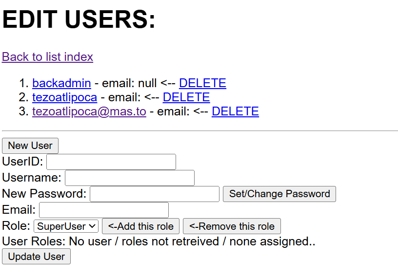

# Managing Users
_The user management page is still rather basic_
Only SuperUsers can manage user accounts. 

The top shows a list of all users in the database's Microsoft Identity schema, along with a link to delete that user. 
User ID is a GUID from the Identity schema and is created automatically (and can't be changed - it doesnt matter much anyway). 

* Username - if you're creating a local user this can be whatever you want. If this is the email or account of someone you want to log in using OAuth from another service, it should be the account from that other service. If you leave it blank but provide an email address below, it will use the email as the account username.
* new password - allows you (the SuperUser)
